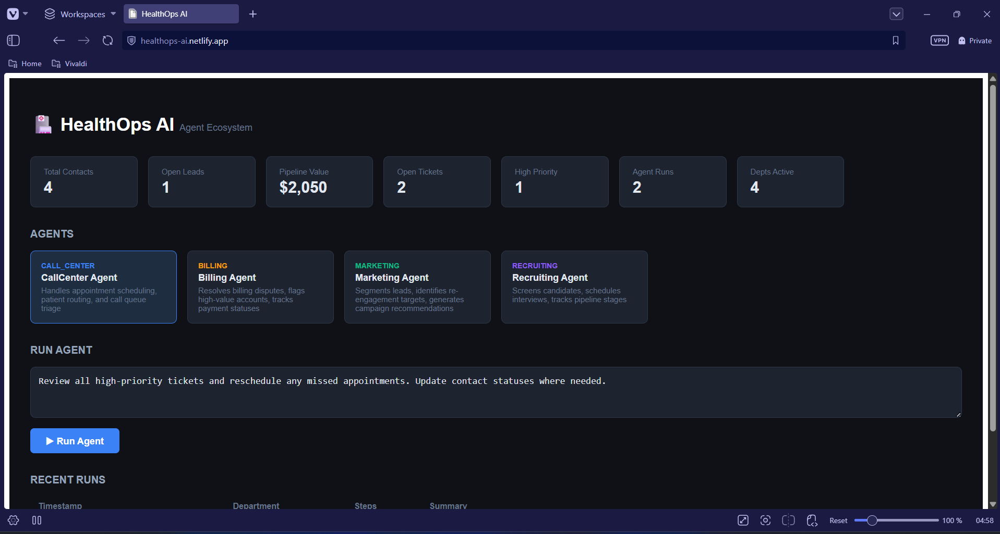

# HealthOps AI — Multi-Agent Ecosystem

A production-grade AI agent ecosystem simulating a multi-department healthcare operation. Four specialized agents run autonomously across Call Center, Billing, Marketing, and Recruiting — each powered by an LLM, equipped with domain-specific tools, and orchestrated via a shared FastAPI backend.



**Live demo:** https://healthops-ai.netlify.app  
**API:** https://healthops-ai.onrender.com/docs
---

## Architecture

```
┌─────────────────────────────────────────────────┐
│              React Dashboard (Netlify)           │
│   Live agent runs · KPIs · Logs · Trigger UI    │
└──────────────────┬──────────────────────────────┘
                   │ REST
┌──────────────────▼──────────────────────────────┐
│         FastAPI Orchestrator (Render)            │
│  /agents  /agents/run  /logs  /kpis  /health    │
└──┬──────────┬──────────┬──────────┬─────────────┘
   │          │          │          │
   ▼          ▼          ▼          ▼
Call       Billing   Marketing  Recruiting
Agent      Agent      Agent      Agent
   │          │          │          │
   └──────────┴──────────┴──────────┘
              │ Tool calls (MCP-style)
   ┌──────────▼──────────────────────┐
   │         Tool Layer              │
   │  CRM · Calendar · Tickets · DB  │
   └─────────────────────────────────┘
```

---

## Agents

| Agent | Department | Responsibilities |
|---|---|---|
| CallCenter Agent | `call_center` | Ticket triage, appointment rescheduling, contact routing |
| Billing Agent | `billing` | Dispute resolution, high-value account flagging, payment status |
| Marketing Agent | `marketing` | Lead segmentation, re-engagement targeting, campaign recommendations |
| Recruiting Agent | `recruiting` | Candidate pipeline review, interview scheduling, stage advancement |

Each agent runs an **agentic tool-call loop** — it receives a task, decides which tools to call, executes them sequentially against the shared data layer, and returns a structured report.

---

## Stack

| Layer | Technology |
|---|---|
| Backend | Python 3.12 · FastAPI · Uvicorn |
| LLM | Groq API (`llama-3.3-70b-versatile`) |
| Agent loop | Custom agentic loop with JSON tool dispatch |
| Tool layer | Mock CRM · Calendar · Ticket DB (JSON-backed) |
| Frontend | React 18 · TypeScript · Vite |
| Deploy — API | Render (free tier) |
| Deploy — UI | Netlify (free tier) |

---

## Project Structure

```
healthops-ai/
├── backend/
│   ├── main.py                  # FastAPI entry point
│   ├── orchestrator.py          # Agent router + KPI aggregator
│   ├── agents/
│   │   ├── base_agent.py        # Agentic loop + Groq client
│   │   ├── call_center_agent.py
│   │   ├── billing_agent.py
│   │   ├── marketing_agent.py
│   │   └── recruiting_agent.py
│   ├── tools/
│   │   ├── crm_tool.py          # HubSpot-style CRM mock
│   │   ├── calendar_tool.py     # Appointment scheduling mock
│   │   └── db_tool.py           # JSON log persistence
│   ├── storage/
│   │   └── logs.json            # Agent run history
│   ├── requirements.txt
│   ├── .python-version          # Pins Python 3.12.3 for Render
│   └── render.yaml
└── frontend/
    ├── src/
    │   ├── App.tsx
    │   ├── main.tsx
    │   ├── api/client.ts        # Typed API client
    │   └── components/
    │       ├── AgentCard.tsx
    │       ├── KpiGrid.tsx
    │       ├── RunAgentPanel.tsx
    │       └── LogsTable.tsx
    ├── index.html
    ├── package.json
    ├── vite.config.ts
    └── netlify.toml
```

---

## API Endpoints

| Method | Endpoint | Description |
|---|---|---|
| `GET` | `/health` | Health check |
| `GET` | `/agents` | List all agents and their metadata |
| `POST` | `/agents/run` | Trigger an agent with a task |
| `GET` | `/logs` | Recent agent run history |
| `GET` | `/kpis` | Aggregated CRM + system metrics |

### Example — Run an agent

```bash
curl -X POST https://healthops-ai.onrender.com/agents/run \
  -H "Content-Type: application/json" \
  -d '{"department": "billing", "task": "Review all open billing tickets and recommend actions."}'
```

Response:
```json
{
  "agent": "Billing Agent",
  "department": "billing",
  "task": "Review all open billing tickets and recommend actions.",
  "steps": [
    { "tool": "get_tickets", "input": { "priority": "high" }, "output": [...] },
    { "tool": "update_contact_status", "input": { "contact_id": "c1", "new_status": "dispute_in_review" }, "output": {...} }
  ],
  "response": "Reviewed 2 open tickets. Escalated invoice dispute for Ana Popescu..."
}
```

---

## Local Setup

### Requirements
- Python 3.12
- Node.js 18+
- Groq API key (free at [console.groq.com](https://console.groq.com))

### Backend

```bash
cd backend
py -3.12 -m venv venv
source venv/Scripts/activate   # Windows/Git Bash
pip install -r requirements.txt

# create .env
echo "GROQ_API_KEY=gsk_..." > .env

uvicorn main:app --reload --port 8000
```

### Frontend

```bash
cd frontend
npm install
echo "VITE_API_URL=http://localhost:8000" > .env.local
npm run dev
# → http://localhost:5173
```

---

## Deploy

### Backend → Render

| Field | Value |
|---|---|
| Root Directory | `backend` |
| Build Command | `pip install -r requirements.txt` |
| Start Command | `uvicorn main:app --host 0.0.0.0 --port $PORT` |
| Env var | `GROQ_API_KEY=gsk_...` |

### Frontend → Netlify

| Field | Value |
|---|---|
| Base directory | `frontend` |
| Build command | `npm run build` |
| Publish directory | `frontend/dist` |
| Env var | `VITE_API_URL=https://your-render-url.onrender.com` |

---

## What I'd Change in Production

- Replace JSON mock layer with PostgreSQL (Neon free tier)
- Add webhook triggers so agents fire on CRM events, not manual input
- Introduce agent-to-agent handoff (Call Center → Billing escalation)
- Add auth to the API (API key middleware or JWT)
- Stream agent responses via SSE instead of blocking HTTP
- Replace Groq with Anthropic Claude for native tool-use support once budget allows

---

## Author

**Istrate Mihai Septimius** — [github.com/istrate-mihai](https://github.com/istrate-mihai)
